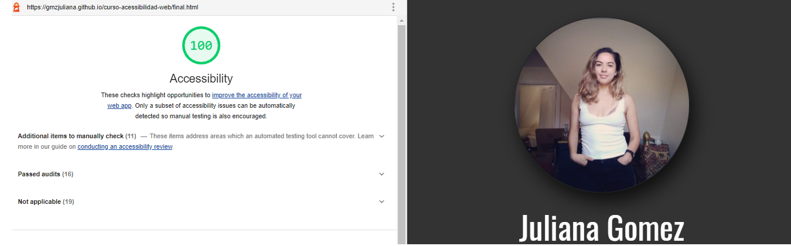

# Accessibility web project

The Juliana's portfolio is a fake portfolio where was implemented the accessibilities webmethods.

This project was tested whit lighthouse chrome and the score was 100%.

The project before adding accessibility methods is the `index.html` file.

The project after adding accessibility methods is the `final.html` file.

Url of final project:
`https://gmzjuliana.github.io/curso-acessibilidad-web/final.html`
